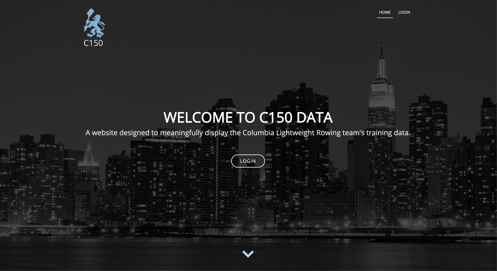

# C150data

C150data is a live web application created with Flask, Bootstrap, SQLAlchemy, and TrainingPeaks API. You can visit the website now at [www.c150data.com](https://www.c150data.com/).



## Table of Contents

* [Introduction](#Introduction)
* [Features](#Features)
* [Site](#Site)
* [Project Layout](#Project-Layout)
* [Technologies](#Technologies)
* [Authors](#Authors)

## Introduction

C150Data is an application designed specifically for the use of the Columbia Lightweight Rowing Team (C150).
Before this application, athletes had no way of viewing the team's training data and it was difficult and time consuming for coaches to compile data for all their athletes in one place. In an effort to solve these problems, C150Data was created. This web application stores and meaningfully displays up to date workout data for all rowers on the team,
allowing coaches and athletes to view organized and detailed team information, all in one place.

C150Data utilizes the TrainingPeaks API to store and display up to date workout information. In order to access this site,
one must be pre-registered by an administrator.

## Features

* Secure login system to keep data private.
* Data page that displays athletes' total training hours within a given date range. The page has sorting and filtering functionality.
* Contact page that allows users to reach out to administrators with comments, questions, or concerns.

## Site

**Login**


**Data**
TODO

## Project Layout
```
.
├── app
│   ├── admin
│   │   └── admin.py              -- Flask-Admin site with views to allow db oversight
│   ├── api
│   │   ├── api_requester.py      -- Handles direct calls to TP API
│   │   ├── api_service.py        -- TP API functions to handl large amounts of similar data
│   │   ├── oauth.py              -- Gets/Updates access tokens for TP API
│   │   └── urls.py               -- Build urls to make API requests
│   ├── data
│   │   └── data.py              -- Holds functions necessary to display hours table 
│   ├── database
│   │   ├── db_filler.py          -- DB functions for large batch requests to TP API
│   │   ├── db_functions.py       -- Handles basic SQL functions
│   │   ├── db_updater.py         -- DB functions for updating database
│   │   └── sql_statements.py     -- Commonly used SQL expressions
│   ├── db_models.py              -- Defines DB objects used in app
│   ├── forms
│   │   └── forms.py              -- Uses flask_wtf to create forms for app
│   ├── __init__.py               -- Initializes app, db, log, etc.
│   ├── mappers
│   │   ├── athlete_mapper.py     -- Handles mapping involving athlete object
│   │   └── workout_mapper.py     -- Handles mapping involving workout object
│   ├── routes.py                 -- Handles all url endpoints - Main driver of app
│   ├── site.db                   -- SQLite DB
│   ├── static                    -- Static files for app
│   │   ├── css
│   │   ├── img
│   │   ├── js
│   │   └── lib
│   └── templates                 -- Templates for app
├── config.py                     -- Config file
├── README.md
└── run.py                        -- Calls __init__ to initialize package structure
```

## Technologies
Below is a complete list of the languages and libraries used in this application, as well as their respective versions.

**API:**
* TrainingPeaks API
* OAuth2 Authentication 3.0.1
* Authlib 0.11

**Web Page:**
* Python 3.7
* Bootstrap 4.0.0
* Flask 1.0.3
* Flask-Admin 1.5.3
* Flask-Bcrypt 0.7.1
* Flask-Login 0.4.1
* Flask-Mail 0.9.1
* Flask-Session 0.3.1
* Flask-SQLAlchemy 2.4.0
* Flask-WTF 0.14.2
* JQuery 3.2.1
* Jinja2 2.10.1
* bcrypt 3.1.7
* python-dateutil 2.8.0
* requests 2.22.0
* urllib3 1.25.2
* Werkzeug 0.15.4
* WTForms 2.2.1
* pyOpenSSL 19.0.0

**Database:**
* SQLAlchemy 1.3.5
* SQLite

**Server Side:**
* gunicorn 19.9.0
* NGINX
* Supervisor
* Linode Server


#### To Do:

* Add a "Training Plan" score for every athlete on the data page. This score will calculate an athlete's completion of the coach-prescribed training plan on a scale from 0 to 100.
* Add a "Test Analysis" page, which will take an in-depth look at the team's performance on every test workout. This page will include graphs and charts that analyze the test results of athletes, groupings of athletes, and the entire team.

 ## Authors
[](https://github.com/ljogeiger) | [](https://github.com/max-amsterdam)
---|---
[Lukas Geiger](https://github.com/ljogeiger) |[Max Amsterdam](https://github.com/max-amsterdam)